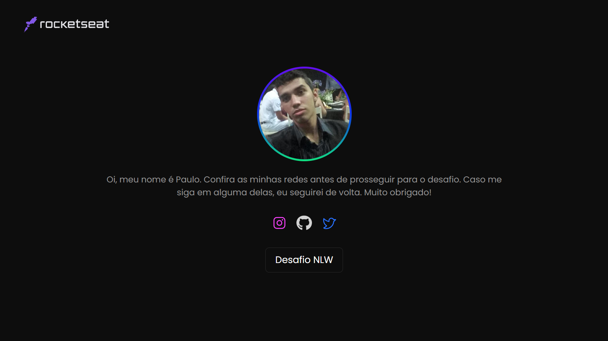
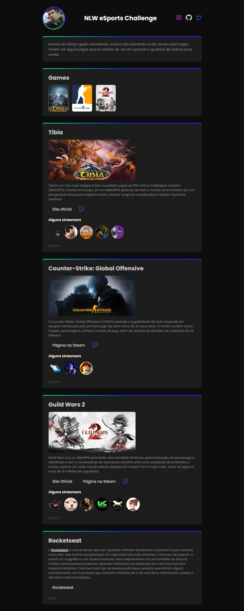

# Desafio NLW eSports com Mayk

Página inicial

Página games

>Trilha Explorer

Caso queira acessar o projeto original:

[Projeto original](https://github.com/juniormrtjy/NLW-eSports)

## 🛠 Tecnologias

- HTML
- CSS
- Git e Github

## Contato

paulorobertomrtjy@gmail.com

>Sobre o desafio

Adicionei uma página extra para funcionar como uma introdução. Coloquei a logo da Rocketseat para quem quiser visitar (não sei bem sobre o direito de usar a logo, se tem algum problema ou não. Caso algum funcionário da empresa veja, me avise por favor se houver algum problema que eu a removo do projeto).

Na página games, decidi separar cada game específico em uma determinada section, para falar um pouco melhor sobre cada game. Coloquei os respectivos streamers de cada jogo, um link para a página ou site oficial e o link para a twitch. Criei um link com uma função simples de fazer o usuário voltar para a section games, para facilitar a navegação.

Por fim, uma section para falar da Rocketseat. Nada extraordinário, apenas um tentativa de levar um possível novo interessado em programação, ao site oficial da empresa.

>Css

Eu separei 4 arquivos css em um tentativa de deixar o código mais limpo. 

- style.css > index.html
- game.css > games.html
- default.css > index.html e games.html
- animations.css > index.html e games.html

O arquivo default.css, contém configurações para ambas as páginas, pegando o que as duas tem em comum e aplicando o estilo à essas propriedades. Estilos únicos para a própria página, estão nos seus respectivos arquivos.

## Muito obrigado 😉

Este foi o meu projeto final. Espero que tenham gostado e que tenham aproveitado bastante este evento incrível! Boa sorte na jornada de vocês!

[Rocketseat](https://www.rocketseat.com.br/)
